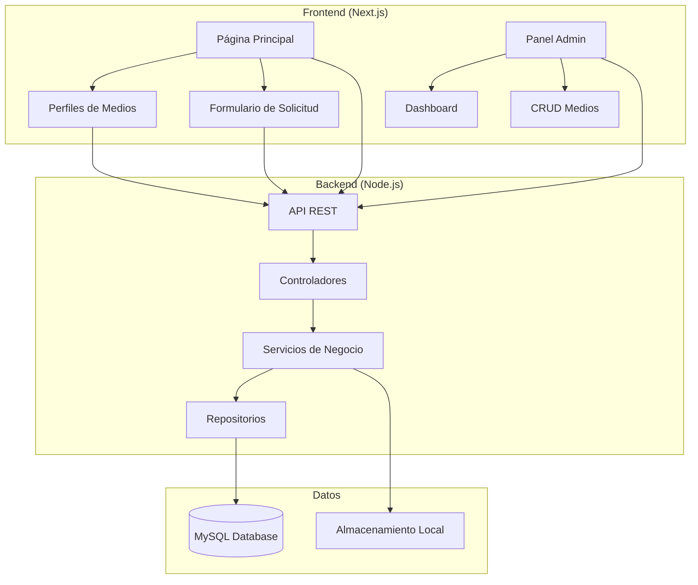

# Documento de Diseño - Directorio de Radios y TV Online

## Resumen

Este documento describe la arquitectura y diseño técnico para la plataforma de directorio de radios y canales de TV online. El sistema está diseñado como una aplicación web full-stack con frontend público y panel administrativo.

## Arquitectura

### Arquitectura General del Sistema



### Arquitectura de Capas

1. **Capa de Presentación (Frontend)**
   - Next.js con React para renderizado híbrido (SSR/CSR)
   - TailwindCSS para estilos y diseño responsive
   - Componentes reutilizables para UI consistente

2. **Capa de API (Backend)**
   - Express.js como framework web
   - Middleware de autenticación JWT
   - Validación de datos con Joi o similar
   - Manejo de errores centralizado

3. **Capa de Lógica de Negocio**
   - Servicios para operaciones complejas
   - Validaciones de negocio
   - Procesamiento de archivos multimedia

4. **Capa de Datos**
   - Repositorios para abstracción de base de datos
   - Modelos de datos con Sequelize ORM
   - Migraciones para control de versiones de BD

## Componentes y Interfaces

### Componentes Frontend

#### Componentes Públicos
```typescript
// Página Principal
interface HomePageProps {
  featuredMedia: Media[]
  newMedia: Media[]
  popularMedia: Media[]
  categories: Category[]
}

// Buscador y Filtros
interface SearchFilterProps {
  onSearch: (query: string) => void
  onFilter: (filters: FilterOptions) => void
  categories: Category[]
  countries: Country[]
}

// Tarjeta de Medio
interface MediaCardProps {
  media: Media
  isHighlighted?: boolean
  showPlayButton?: boolean
}

// Perfil de Medio
interface MediaProfileProps {
  media: Media
  schedule?: Schedule[]
  socialLinks: SocialLink[]
}

// Reproductor
interface MediaPlayerProps {
  streamUrl: string
  mediaType: 'radio' | 'tv'
  mediaName: string
  autoplay?: boolean
}
```

#### Componentes Administrativos
```typescript
// Dashboard
interface AdminDashboardProps {
  stats: {
    totalMedia: number
    activeMedia: number
    totalViews: number
    pendingRequests: number
  }
}

// Formulario de Medio
interface MediaFormProps {
  media?: Media
  onSubmit: (data: MediaFormData) => void
  onCancel: () => void
}

// Lista de Medios
interface MediaListProps {
  media: Media[]
  onEdit: (id: string) => void
  onDelete: (id: string) => void
  onToggleStatus: (id: string) => void
}
```

### APIs Backend

#### Endpoints Públicos
```typescript
// Medios
GET    /api/media                 // Listar medios con filtros
GET    /api/media/:id             // Obtener medio específico
GET    /api/media/featured        // Medios destacados
GET    /api/media/popular         // Medios populares
GET    /api/media/recent          // Medios recientes

// Categorías y Filtros
GET    /api/categories            // Listar categorías
GET    /api/countries             // Listar países

// Solicitudes
POST   /api/requests              // Enviar solicitud de adhesión

// Estadísticas
POST   /api/stats/play/:id        // Registrar reproducción
POST   /api/stats/view/:id        // Registrar vista
```

#### Endpoints Administrativos
```typescript
// Autenticación
POST   /api/admin/login           // Login administrador
POST   /api/admin/refresh         // Renovar token

// Gestión de Medios
GET    /api/admin/media           // Listar todos los medios
POST   /api/admin/media           // Crear nuevo medio
PUT    /api/admin/media/:id       // Actualizar medio
DELETE /api/admin/media/:id       // Eliminar medio
PATCH  /api/admin/media/:id/status // Cambiar estado

// Solicitudes
GET    /api/admin/requests        // Listar solicitudes pendientes
PUT    /api/admin/requests/:id    // Aprobar/rechazar solicitud

// Archivos
POST   /api/admin/upload          // Subir archivos (logos, banners)

// Dashboard
GET    /api/admin/stats           // Estadísticas del dashboard
```

## Modelos de Datos

### Esquema de Base de Datos

```sql
-- Tabla de Medios
CREATE TABLE media (
    id VARCHAR(36) PRIMARY KEY,
    name VARCHAR(255) NOT NULL,
    slug VARCHAR(255) UNIQUE NOT NULL,
    type ENUM('radio', 'tv') NOT NULL,
    description TEXT,
    stream_url VARCHAR(500) NOT NULL,
    logo_url VARCHAR(500),
    banner_url VARCHAR(500),
    country VARCHAR(100),
    city VARCHAR(100),
    category_id INT,
    is_active BOOLEAN DEFAULT true,
    is_featured BOOLEAN DEFAULT false,
    is_verified BOOLEAN DEFAULT false,
    view_count INT DEFAULT 0,
    play_count INT DEFAULT 0,
    created_at TIMESTAMP DEFAULT CURRENT_TIMESTAMP,
    updated_at TIMESTAMP DEFAULT CURRENT_TIMESTAMP ON UPDATE CURRENT_TIMESTAMP,
    FOREIGN KEY (category_id) REFERENCES categories(id)
);

-- Tabla de Categorías
CREATE TABLE categories (
    id INT AUTO_INCREMENT PRIMARY KEY,
    name VARCHAR(100) NOT NULL UNIQUE,
    slug VARCHAR(100) NOT NULL UNIQUE,
    description TEXT,
    created_at TIMESTAMP DEFAULT CURRENT_TIMESTAMP
);

-- Tabla de Redes Sociales
CREATE TABLE social_links (
    id INT AUTO_INCREMENT PRIMARY KEY,
    media_id VARCHAR(36) NOT NULL,
    platform VARCHAR(50) NOT NULL,
    url VARCHAR(500) NOT NULL,
    FOREIGN KEY (media_id) REFERENCES media(id) ON DELETE CASCADE
);

-- Tabla de Programación
CREATE TABLE schedules (
    id INT AUTO_INCREMENT PRIMARY KEY,
    media_id VARCHAR(36) NOT NULL,
    day_of_week TINYINT NOT NULL, -- 0=Domingo, 6=Sábado
    start_time TIME NOT NULL,
    end_time TIME NOT NULL,
    program_name VARCHAR(255) NOT NULL,
    description TEXT,
    FOREIGN KEY (media_id) REFERENCES media(id) ON DELETE CASCADE
);

-- Tabla de Solicitudes
CREATE TABLE requests (
    id INT AUTO_INCREMENT PRIMARY KEY,
    name VARCHAR(255) NOT NULL,
    email VARCHAR(255) NOT NULL,
    media_name VARCHAR(255) NOT NULL,
    media_type ENUM('radio', 'tv') NOT NULL,
    stream_url VARCHAR(500) NOT NULL,
    description TEXT,
    country VARCHAR(100),
    city VARCHAR(100),
    website VARCHAR(500),
    status ENUM('pending', 'approved', 'rejected') DEFAULT 'pending',
    created_at TIMESTAMP DEFAULT CURRENT_TIMESTAMP,
    processed_at TIMESTAMP NULL
);

-- Tabla de Administradores
CREATE TABLE admins (
    id INT AUTO_INCREMENT PRIMARY KEY,
    username VARCHAR(100) NOT NULL UNIQUE,
    email VARCHAR(255) NOT NULL UNIQUE,
    password_hash VARCHAR(255) NOT NULL,
    is_active BOOLEAN DEFAULT true,
    last_login TIMESTAMP NULL,
    created_at TIMESTAMP DEFAULT CURRENT_TIMESTAMP
);

-- Tabla de Estadísticas
CREATE TABLE stats (
    id INT AUTO_INCREMENT PRIMARY KEY,
    media_id VARCHAR(36) NOT NULL,
    event_type ENUM('view', 'play') NOT NULL,
    ip_address VARCHAR(45),
    user_agent TEXT,
    created_at TIMESTAMP DEFAULT CURRENT_TIMESTAMP,
    FOREIGN KEY (media_id) REFERENCES media(id) ON DELETE CASCADE
);
```

### Modelos TypeScript

```typescript
// Modelo de Medio
interface Media {
  id: string
  name: string
  slug: string
  type: 'radio' | 'tv'
  description?: string
  streamUrl: string
  logoUrl?: string
  bannerUrl?: string
  country?: string
  city?: string
  categoryId?: number
  category?: Category
  isActive: boolean
  isFeatured: boolean
  isVerified: boolean
  viewCount: number
  playCount: number
  socialLinks: SocialLink[]
  schedules: Schedule[]
  createdAt: Date
  updatedAt: Date
}

// Modelo de Categoría
interface Category {
  id: number
  name: string
  slug: string
  description?: string
  createdAt: Date
}

// Modelo de Red Social
interface SocialLink {
  id: number
  mediaId: string
  platform: string
  url: string
}

// Modelo de Programación
interface Schedule {
  id: number
  mediaId: string
  dayOfWeek: number
  startTime: string
  endTime: string
  programName: string
  description?: string
}

// Modelo de Solicitud
interface Request {
  id: number
  name: string
  email: string
  mediaName: string
  mediaType: 'radio' | 'tv'
  streamUrl: string
  description?: string
  country?: string
  city?: string
  website?: string
  status: 'pending' | 'approved' | 'rejected'
  createdAt: Date
  processedAt?: Date
}
```

## Manejo de Errores

### Estrategia de Manejo de Errores

1. **Frontend**
   - Error Boundaries para capturar errores de React
   - Toast notifications para errores de usuario
   - Páginas de error personalizadas (404, 500)
   - Retry automático para fallos de red

2. **Backend**
   - Middleware centralizado de manejo de errores
   - Logging estructurado con Winston
   - Códigos de error HTTP apropiados
   - Mensajes de error consistentes

```typescript
// Tipos de Error Personalizados
class ValidationError extends Error {
  constructor(message: string, public field: string) {
    super(message)
    this.name = 'ValidationError'
  }
}

class NotFoundError extends Error {
  constructor(resource: string) {
    super(`${resource} not found`)
    this.name = 'NotFoundError'
  }
}

class UnauthorizedError extends Error {
  constructor(message = 'Unauthorized') {
    super(message)
    this.name = 'UnauthorizedError'
  }
}
```

## Estrategia de Testing

### Testing Frontend
- **Unit Tests:** Jest + React Testing Library
- **Integration Tests:** Cypress para flujos E2E
- **Visual Tests:** Storybook para componentes
- **Performance Tests:** Lighthouse CI

### Testing Backend
- **Unit Tests:** Jest para lógica de negocio
- **Integration Tests:** Supertest para APIs
- **Database Tests:** Base de datos en memoria
- **Load Tests:** Artillery para rendimiento

### Cobertura de Testing
```typescript
// Ejemplo de test de componente
describe('MediaCard', () => {
  it('should render media information correctly', () => {
    const media = createMockMedia()
    render(<MediaCard media={media} />)
    
    expect(screen.getByText(media.name)).toBeInTheDocument()
    expect(screen.getByRole('img')).toHaveAttribute('src', media.logoUrl)
  })
  
  it('should handle play button click', () => {
    const onPlay = jest.fn()
    const media = createMockMedia()
    render(<MediaCard media={media} onPlay={onPlay} />)
    
    fireEvent.click(screen.getByRole('button', { name: /play/i }))
    expect(onPlay).toHaveBeenCalledWith(media.id)
  })
})

// Ejemplo de test de API
describe('GET /api/media', () => {
  it('should return paginated media list', async () => {
    const response = await request(app)
      .get('/api/media?page=1&limit=10')
      .expect(200)
    
    expect(response.body).toHaveProperty('data')
    expect(response.body).toHaveProperty('pagination')
    expect(response.body.data).toHaveLength(10)
  })
})
```

## Consideraciones de Seguridad

### Autenticación y Autorización
- JWT con refresh tokens
- Rate limiting en APIs
- Validación de entrada en todos los endpoints
- Sanitización de datos para prevenir XSS

### Protección de Datos
- Encriptación de contraseñas con bcrypt
- Validación de URLs de streaming
- Filtrado de contenido malicioso en uploads
- Headers de seguridad (CORS, CSP, etc.)

### Monitoreo y Logging
- Logs de acceso y errores
- Monitoreo de intentos de login fallidos
- Alertas para actividad sospechosa
- Backup automático de base de datos

## Optimización de Rendimiento

### Frontend
- Code splitting con Next.js
- Lazy loading de imágenes
- Caching de componentes con React.memo
- Optimización de bundle size

### Backend
- Caching con Redis (opcional)
- Compresión gzip
- Optimización de consultas SQL
- CDN para archivos estáticos

### Base de Datos
- Índices en campos de búsqueda frecuente
- Paginación eficiente
- Consultas optimizadas con joins
- Archivado de datos históricos